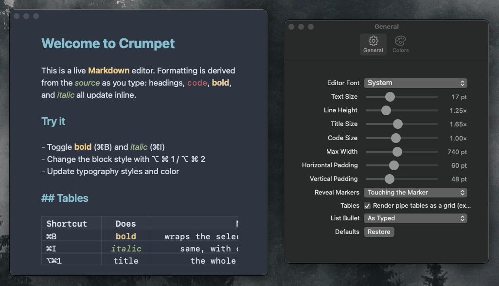

# Crumpet

<p align="center">
  
</p>

A native Markdown editor for SwiftUI on macOS and iOS, with live syntax highlighting from [tree-sitter].

- **Native text editing.** SwiftUI view, backed by `NSTextView` on macOS and `UITextView` on iOS.
- **Live highlighting.** Tree-sitter reparses incrementally as you type, so large documents stay fast.
- **Hidden markup.** Markdown syntax are optionally hidden.
- **Tunable typography.** Set the typeface, size, line height, title and code scale, column width, and padding.
- **Themeable.** Controls for colorizing headers, bold, italic, etc.
- **Drop-in settings pabel.** Store `EditorSettings` in `@AppStorage` and edit it with `EditorSettingsForm`.
- **Smart lists.** List are automatically continued, and the bullet is customizable.
- **Pipe tables.** Tables render as a grid (experimental).

## Installation

Crumpet requires macOS 15 or iOS 18 and Swift 6. Add the package to your `Package.swift`:

```swift
.package(url: "https://github.com/octavore/crumpet", from: "0.1.0")
```

Then add the `Crumpet` product to your target's dependencies.

## Quick start

```swift
import Crumpet
import SwiftUI

struct ContentView: View {
  @State private var text = "# Hello\n\nStart typing…"

  var body: some View {
    MarkdownEditor(text: $text)
      .editorFont(.serif)
      .editorFontSize(18)
      .editorLineHeight(1.4)
      .editorColorScheme(.init(heading: .blue, code: .pink, bold: .orange, italic: .teal))
  }
}
```

## Guides

### Drop-in settings panel

To let your users customize the editor without wiring each modifier by hand, persist the `EditorSettings` value and hand it to the editor. `EditorSettings` is `RawRepresentable` as JSON, so it stores directly in `@AppStorage`. Render `EditorSettingsForm` in your own `Form` to edit it.

```swift
struct EditorScreen: View {
  @AppStorage("editorSettings") private var settings = EditorSettings()
  @State private var text = ""

  var body: some View {
    MarkdownEditor(text: $text).editorSettings(settings)
  }
}

struct SettingsScreen: View {
  @AppStorage("editorSettings") private var settings = EditorSettings()
  @AppStorage("myOwnOption") private var myOwnOption = false

  var body: some View {
    Form {
      EditorSettingsForm(settings: $settings)
      // Your own rows sit alongside.
      Toggle("My Own Option", isOn: $myOwnOption)
    }
  }
}
```

`EditorSettingsForm` renders bare rows, not a container, so it inherits the chrome of whatever `Form`, `List`, or `Section` you place it in. The example app's `SettingsView` uses it directly.

### Live updates while updating settings

SwiftUI does not update an editor in another window while a slider drag is in progress, so on macOS the editor restyles only when the drag ends. To restyle during the drag, share one `EditorSettingsChannel` between both scenes and send each new value through it. The channel does not persist anything, so keep storing the settings in `@AppStorage`.

```swift
enum AppSettings {
  @MainActor static let editorChannel = EditorSettingsChannel()
}

// In the editor scene:
MarkdownEditor(text: $text)
  .editorSettings(settings)
  .editorSettingsChannel(AppSettings.editorChannel)

// In the settings scene:
Form { EditorSettingsForm(settings: $settings) }
  .onChange(of: settings) { _, new in AppSettings.editorChannel.send(new) }
```

### Formatting commands

To manage formatting from your own UI, hold an `EditorCommands`, attach it to the editor, and call `send(_:)`:

```swift
struct EditorScreen: View {
  @State private var text = ""
  @State private var commands = EditorCommands()

  var body: some View {
    MarkdownEditor(text: $text)
      .commands(commands)
      .toolbar {
        Button("Bold") { commands.send(.toggleBold) }
        Button("Italic") { commands.send(.toggleItalic) }
        Menu("Style") {
          ForEach(TextStyle.allCases) { style in
            Button(style.displayName) { commands.send(.setBlockStyle(style)) }
              .keyboardShortcut(style.shortcutKey, modifiers: [.command, .option])
          }
        }
      }
  }
}
```

### Importing a theme (experimental)

`EditorColorScheme` parses a pasted Slack-inspired theme string: at least eight hex colors in Slack's own order (Column BG, Menu BG Hover, Active Item, Active Item Text, Hover Item, Text Color, Active Presence, Mention Badge, and optionally Top Nav Background and Top Nav Text). Slots 1, 3, 4, 6, 7, and 8 map onto the editor as `background`, `heading`, `bold`, `text`, `italic`, and `code`. The editor ignores the hover and top-nav slots. Parsing returns `nil` if any color fails to parse as hex.

```swift
let strings = EditorColorScheme.splitThemeString(pasted)
if let scheme = EditorColorScheme(themeStrings: strings) {
  // apply scheme
}
```

## API reference

### `MarkdownEditor`

A SwiftUI `View` that edits a Markdown `String`.

```swift
init(text: Binding<String>)
```

Each modifier returns a new `MarkdownEditor`, so apply them directly to the editor, before any other SwiftUI modifier.

| Modifier                                           | Effect                                                                                                                      | Default     |
| -------------------------------------------------- | --------------------------------------------------------------------------------------------------------------------------- | ----------- |
| `.editorFont(_: EditorFont)`                       | Typeface.                                                                                                                   | `.system`   |
| `.editorFontSize(_: CGFloat)`                      | Base body point size. Titles, headings, and code scale from it.                                                             | `17`        |
| `.editorTitleRatio(_: CGFloat)`                    | Title size as a multiple of the base size. Headings stay at 22:17.                                                          | `28 / 17`   |
| `.editorCodeRatio(_: CGFloat)`                     | Inline and block code size as a multiple of the base size, including code inside a heading.                                 | `1.0`       |
| `.editorLineHeight(_: CGFloat)`                    | Line height as a multiple of the font's natural line height.                                                                | `1.25`      |
| `.editorMaxWidth(_: CGFloat)`                      | Max width of the centered text column, in points. The editor still fills its container.                                     | `720`       |
| `.editorHorizontalPadding(_: CGFloat)`             | Minimum padding on each side of the text column, in points.                                                                 | `16`        |
| `.markerRevealMode(_: MarkerRevealMode)`           | When concealed markers reveal.                                                                                              | `.span`     |
| `.experimentalTables(_: Bool)`                     | Renders pipe tables as a grid with the `\|` separators and `\|---\|` row hidden. When off, tables stay plain text.          | `false`     |
| `.editorColorScheme(_: EditorColorScheme)`         | Construct colors and the page background.                                                                                   | `.standard` |
| `.editorTopContentInset(_: CGFloat)`               | Starts the document below an overlaying bar of this height while still scrolling under it.                                  | `0`         |
| `.onScroll(_: (CGFloat) -> Void)`                  | Called with the vertical scroll offset whenever the document scrolls. The offset is 0 at the top and ignores the top inset. | none        |
| `.commands(_: EditorCommands)`                     | Routes formatting commands into this editor. Pass the same instance for the editor's lifetime.                              | none        |
| `.editorSettings(_: EditorSettings)`               | Applies every option in the bundle, equivalent to calling each matching modifier.                                           | none        |
| `.editorSettingsChannel(_: EditorSettingsChannel)` | Subscribes the editor to live settings updates.                                                                             | none        |

The list bullet style has no modifier of its own. Set it with `.editorSettings(_:)`.

### `EditorSettings`

A `Codable`, `Equatable`, `Sendable` struct holding every non-color option. It conforms to `RawRepresentable` with a JSON `String` raw value, so it works with `@AppStorage`. Decoding fills any missing key with its default, and invalid JSON or a key of the wrong type makes `init?(rawValue:)` return `nil`.

```swift
init(
  font: EditorFont = .system,
  fontSize: Double = 17,
  lineHeight: Double = 1.25,
  titleRatio: Double = 28.0 / 17.0,
  codeRatio: Double = 1.0,
  maxWidth: Double = 720,
  horizontalPadding: Double = 16,
  markerRevealMode: MarkerRevealMode = .span,
  experimentalTables: Bool = false,
  listBullet: ListBulletStyle = .asTyped
)
```

| Property             | Type               | Matching modifier              | Form range  |
| -------------------- | ------------------ | ------------------------------ | ----------- |
| `font`               | `EditorFont`       | `.editorFont(_:)`              |             |
| `fontSize`           | `Double`           | `.editorFontSize(_:)`          | 12 to 28    |
| `lineHeight`         | `Double`           | `.editorLineHeight(_:)`        | 1.0 to 2.0  |
| `titleRatio`         | `Double`           | `.editorTitleRatio(_:)`        | 1.0 to 2.5  |
| `codeRatio`          | `Double`           | `.editorCodeRatio(_:)`         | 0.6 to 1.6  |
| `maxWidth`           | `Double`           | `.editorMaxWidth(_:)`          | 400 to 1200 |
| `horizontalPadding`  | `Double`           | `.editorHorizontalPadding(_:)` | 0 to 160    |
| `markerRevealMode`   | `MarkerRevealMode` | `.markerRevealMode(_:)`        |             |
| `experimentalTables` | `Bool`             | `.experimentalTables(_:)`      |             |
| `listBullet`         | `ListBulletStyle`  | none                           |             |

The form ranges limit only `EditorSettingsForm`'s sliders. The editor accepts values outside them.

### `EditorSettingsForm`

A `View` of bare rows for editing an `EditorSettings`: a font picker; sliders for text size, line height, title size, code size, max width, and horizontal padding; a marker-reveal picker; a tables toggle; a list-bullet picker; and a restore-defaults button.

```swift
init(settings: Binding<EditorSettings>)
```

### `EditorSettingsChannel`

A `@MainActor` class that applies settings to every attached editor synchronously, without waiting for a SwiftUI update. Use one channel for the whole app.

| Member                                | Description                                                                                               |
| ------------------------------------- | --------------------------------------------------------------------------------------------------------- |
| `init()`                              | Creates a channel with no editors attached.                                                               |
| `send(_ settings: EditorSettings)`    | Restyles every attached editor before returning. Sending an unchanged value does nothing.                 |

### `EditorColorScheme`

A `Sendable`, `Equatable` struct of colors.

```swift
init(
  text: Color = .primary,
  heading: Color? = nil,
  code: Color? = nil,
  bold: Color? = nil,
  italic: Color? = nil,
  listBullet: Color? = nil,
  background: Color = .editorBackground
)
```

| Member                                           | Description                                                                           |
| ------------------------------------------------ | ------------------------------------------------------------------------------------- |
| `text`                                           | Body text, ordered list markers, and every construct without its own color.           |
| `heading`                                        | Title and heading text. Defaults to `text`.                                           |
| `code`                                           | Inline code and code blocks. Defaults to `text`.                                      |
| `bold`                                           | Bold text. Defaults to `text`.                                                        |
| `italic`                                         | Italic text. Defaults to `text`.                                                      |
| `listBullet`                                     | Unordered list bullet glyphs. Defaults to `text`.                                     |
| `background`                                     | Page background. Defaults to `Color.editorBackground`.                                |
| `static standard`                                | Every construct in `.primary` on `Color.editorBackground`.                            |
| `init?(themeStrings: [String])`                  | Builds a scheme from Slack theme colors. See [Importing a theme](#importing-a-theme). |
| `static splitThemeString(_: String) -> [String]` | Splits a comma- or whitespace-separated theme string into hex strings.                |

### `EditorCommands` and `EditorCommand`

`EditorCommands` is a `@MainActor` class that sends formatting actions to the editor it is attached to.

| Member                             | Description                                                                                                   |
| ---------------------------------- | ------------------------------------------------------------------------------------------------------------- |
| `init()`                           | Creates a bridge with no editor attached.                                                                     |
| `send(_ command: EditorCommand)`   | Applies the command to the attached editor. Does nothing if no editor is attached.                            |

If several editors share one instance, commands go to the editor created most recently.

| `EditorCommand` case        | Effect                                                                                                                        |
| --------------------------- | ----------------------------------------------------------------------------------------------------------------------------- |
| `.toggleBold`               | With no selection, inserts `****` and places the caret in the middle. Otherwise removes `**` around the selection or adds it. |
| `.toggleItalic`             | The same as `.toggleBold`, with `*`.                                                                                          |
| `.setBlockStyle(TextStyle)` | Replaces the `#` or `##` prefix of the paragraph at the start of the selection with the style's prefix.                       |

### Enums

Every enum below has a `String` raw value, conforms to `CaseIterable`, `Identifiable`, and `Sendable`, and has a `displayName` for menus and pickers. All except `TextStyle` are also `Codable`.

| `EditorFont` | Design                  |
| ------------ | ----------------------- |
| `.system`    | San Francisco (default) |
| `.serif`     | New York                |
| `.rounded`   | SF Pro Rounded          |
| `.monospaced`| SF Mono                 |

`EditorFont.previewFont` returns a 15 pt SwiftUI `Font` in the design, for previewing each option in a picker.

| `MarkerRevealMode` | Markers reveal when                                               |
| ------------------ | ----------------------------------------------------------------- |
| `.span`            | The caret touches the marked span, delimiters included (default). |
| `.line`            | The caret is anywhere on the marker's line.                       |
| `.always`          | Always. Markers are never concealed.                              |

| `ListBulletStyle` | Unordered markers render as          |
| ----------------- | ------------------------------------ |
| `.asTyped`        | The typed `-`, `*`, or `+` (default) |
| `.disc`           | •                                    |
| `.ring`           | ◦                                    |
| `.square`         | ▪                                    |
| `.dash`           | –                                    |

Bullet styles change only the drawn glyph. The Markdown source keeps the typed character, and ordered markers are never replaced.

| `TextStyle` | Markdown prefix | Weight   | Size               | `shortcutKey` |
| ----------- | --------------- | -------- | ------------------ | ------------- |
| `.title`    | `#`             | Bold     | Base × title ratio | `1`           |
| `.heading`  | `##`            | Semibold | Base × 22 / 17     | `2`           |
| `.body`     | none            | Regular  | Base               | `0`           |

`shortcutKey` is a suggested `KeyEquivalent`. The editor installs no shortcuts, so pair it with your own modifiers.

### `Typography`

A namespace of defaults, form ranges, and `UserDefaults` keys. The editor reads the keys once at launch to seed its first render, and its modifiers take over once they apply.

| Option             | Default                     | Range                    | `UserDefaults` key                                         |
| ------------------ | --------------------------- | ------------------------ | ---------------------------------------------------------- |
| Font               | `EditorFont.system`         |                          | `EditorFont.defaultsKey` (`editorFont`)                    |
| Base size          | `defaultBaseSize`           | `sizeRange`              | `sizeDefaultsKey` (`editorFontSize`)                       |
| Line height        | `defaultLineHeightMultiple` | `lineHeightRange`        | `lineHeightDefaultsKey` (`editorLineHeightMultiple`)       |
| Title ratio        | `defaultTitleRatio`         | `titleRatioRange`        | `titleRatioDefaultsKey` (`editorTitleRatio`)               |
| Code ratio         | `defaultCodeRatio`          | `codeRatioRange`         | `codeRatioDefaultsKey` (`editorCodeRatio`)                 |
| Max width          | `defaultMaxTextWidth`       | `maxTextWidthRange`      | `maxTextWidthDefaultsKey` (`editorMaxTextWidth`)           |
| Horizontal padding | `defaultHorizontalPadding`  | `horizontalPaddingRange` | `horizontalPaddingDefaultsKey` (`editorHorizontalPadding`) |
| Reveal mode        | `MarkerRevealMode.span`     |                          | `MarkerRevealMode.defaultsKey` (`markerRevealMode`)        |
| Tables             | `defaultTablesEnabled`      |                          | `tablesDefaultsKey` (`editorTablesEnabled`)                |
| List bullet        | `defaultListBulletStyle`    |                          | `ListBulletStyle.defaultsKey` (`editorListBulletStyle`)    |

### `Color` extensions

| Member                    | Description                                                                                                                                                             |
| ------------------------- | ----------------------------------------------------------------------------------------------------------------------------------------------------------------------- |
| `static editorBackground` | The editor's adaptive page background (`textBackgroundColor` on macOS, `systemBackground` on iOS). Match surrounding chrome to it.                                      |
| `init?(hex: String)`      | Parses `#RGB`, `#RRGGBB`, or `#RRGGBBAA`, with or without `#`. In-between lengths use the leading 8, 6, or 3 digits. Nil for non-hex characters or fewer than 3 digits. |

## Example app

The [`Example/`](Example) directory is a standalone Swift package that imports `Crumpet` as a dependency, the same way a real app would (see [`Example/Package.swift`](Example/Package.swift)). It contains an editor and a settings screen with a General tab (`EditorSettingsForm`) and a Colors tab (custom `EditorColorScheme` presets and color pickers). It stores settings in `@AppStorage`, keeps the document in memory only, and makes no network requests.

Build and run it from the `Example/` directory:

```sh
cd Example
swift build              # compile the app against the library
strudel build            # macOS app bundle
strudel run              # run macOS app bundle
strudel run --sim        # iOS Simulator
strudel run --device     # connected device
```

## Development

The library and example are separate packages. From the repo root:

```sh
swift build                        # build the library
swift test --skip PerformanceTests # run the library tests
swift build --package-path Example # build the standalone example
```

The same tasks are available through `axo`:

```sh
axo build            # swift build
axo test             # swift test --skip PerformanceTests
axo fmt              # swift format the whole repo
axo readme:lint      # lint README.md with rumdl
axo release 0.2.0    # build, test, then tag and push a release
```

[tree-sitter]: https://tree-sitter.github.io/tree-sitter/
